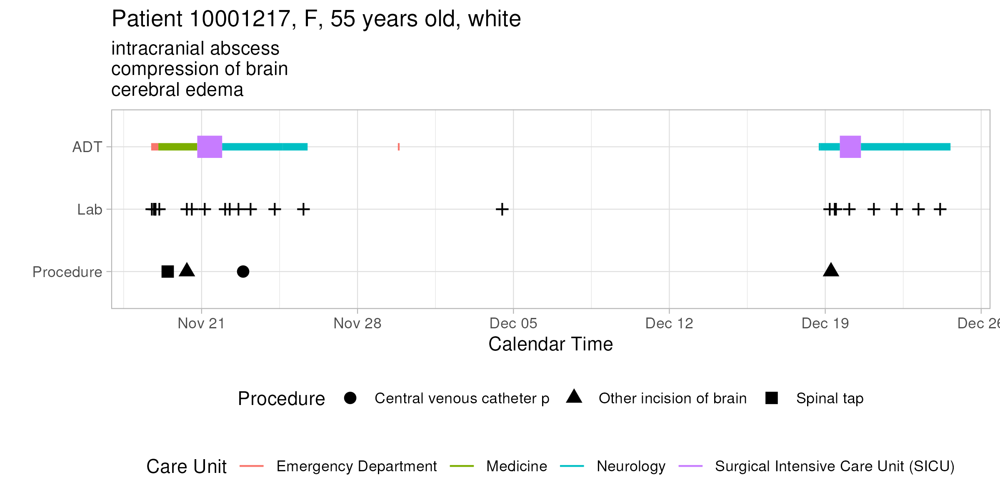
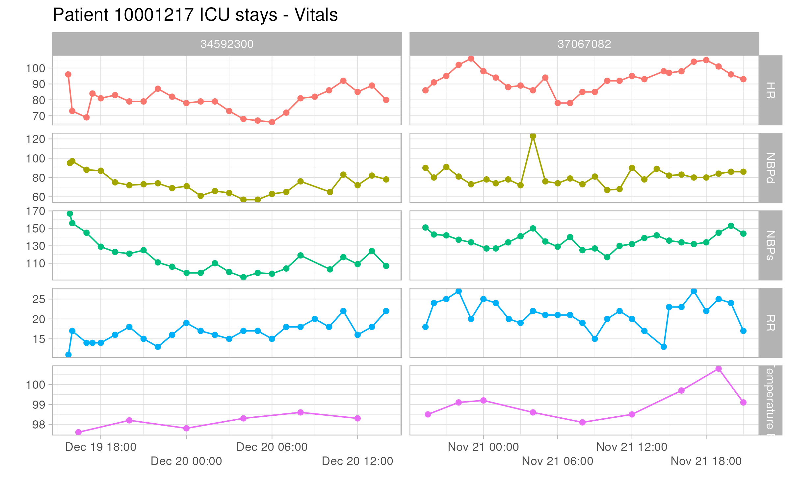
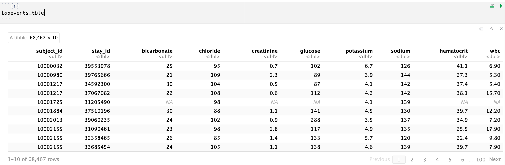
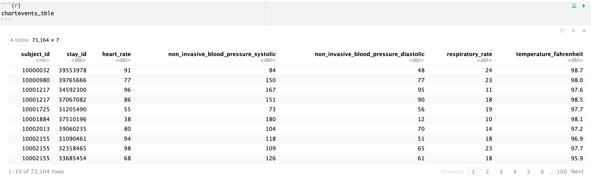
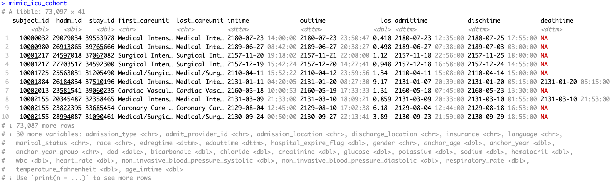

Display machine information for reproducibility:
```{r}
sessionInfo()
```

Load necessary libraries (you can add more as needed).
```{r setup}
library(arrow)
library(memuse)
library(pryr)
library(R.utils)
library(tidyverse)
library(ggplot2)
```

Display your machine memory.
```{r}
memuse::Sys.meminfo()
```

In this exercise, we use tidyverse (ggplot2, dplyr, etc) to explore the [MIMIC-IV](https://mimic.mit.edu/docs/iv/) data introduced in [homework 1](https://ucla-biostat-203b.github.io/2024winter/hw/hw1/hw1.html) and to build a cohort of ICU stays.

## Q1. Visualizing patient trajectory

Visualizing a patient's encounters in a health care system is a common task in clinical data analysis. In this question, we will visualize a patient's ADT (admission-discharge-transfer) history and ICU vitals in the MIMIC-IV data.

### Q1.1 ADT history

A patient's ADT history records the time of admission, discharge, and transfer in the hospital. This figure shows the ADT history of the patient with `subject_id` 10001217 in the MIMIC-IV data. The x-axis is the calendar time, and the y-axis is the type of event (ADT, lab, procedure). The color of the line segment represents the care unit. The size of the line segment represents whether the care unit is an ICU/CCU. The crosses represent lab events, and the shape of the dots represents the type of procedure. The title of the figure shows the patient's demographic information and the subtitle shows top 3 diagnoses.


Do a similar visualization for the patient with `subject_id` 10013310 using ggplot.

Hint: We need to pull information from data files `patients.csv.gz`, `admissions.csv.gz`, `transfers.csv.gz`, `labevents.csv.gz`, `procedures_icd.csv.gz`, `diagnoses_icd.csv.gz`, `d_icd_procedures.csv.gz`, and `d_icd_diagnoses.csv.gz`. For the big file `labevents.csv.gz`, use the Parquet format you generated in Homework 2. For reproducibility, make the Parquet folder `labevents_pq` available at the current working directory `hw3`, for example, by a symbolic link. Make your code reproducible.

```{r}
# Extract datasets and filter useful information
patient_id <- 10013310
patients <- read_csv("~/mimic/hosp/patients.csv.gz", show_col_types = FALSE) |>
  filter(subject_id == patient_id) |>
  select(subject_id, gender, anchor_age) |>
  collect()

admissions <- read_csv("~/mimic/hosp/admissions.csv.gz", 
                       show_col_types = FALSE) |>
  filter(subject_id == patient_id) |>
  select(subject_id, race)|>
  distinct()|>
  collect()

adt <- read_csv("~/mimic/hosp/transfers.csv.gz", show_col_types = FALSE) |>
  filter(subject_id == patient_id) |>
  select(intime, outtime, careunit)|>
  drop_na()|>
  collect()

lab <- arrow::open_dataset("labevents_pq/part-0.parquet", format = "parquet")%>% 
  dplyr::filter(subject_id == patient_id) %>% 
  dplyr::select(charttime) %>% 
  dplyr::distinct() %>%
  collect()

procedures_icd <- read_csv("~/mimic/hosp/procedures_icd.csv.gz", 
                           show_col_types = FALSE) |>
  filter(subject_id == patient_id) |>
  select(subject_id, seq_num, icd_code, chartdate)|>
  collect()

diagnoses_icd <- read_csv("~/mimic/hosp/diagnoses_icd.csv.gz",
                          show_col_types = FALSE) |>
  filter(subject_id == patient_id & seq_num <= 3) |>
  select(subject_id, seq_num, icd_code)|>
  collect()

d_icd_procedures <- read_csv("~/mimic/hosp/d_icd_procedures.csv.gz",
                             show_col_types = FALSE) |>
  select(icd_code, long_title)|>
  collect()

d_icd_diagnoses <- read_csv("~/mimic/hosp/d_icd_diagnoses.csv.gz",
                            show_col_types = FALSE) |>
  select(icd_code, long_title)|>
  collect()
```


```{r}
# top 3 diagnoses
diag <- left_join(diagnoses_icd, d_icd_diagnoses, by = "icd_code")|>
  select(long_title)|>
  table()|>
  sort(decreasing = TRUE)|>
  names()

top_3_diag <- diag[1:3]

procedure <- left_join(procedures_icd, d_icd_procedures, by = "icd_code")|>
  select(chartdate, long_title)

# patient's demographic information
patient_profile <- left_join(patients, admissions, by = "subject_id")

patient_profile
```

```{r}
# First create a blank plot with x and y axis labels
blank_plot <- ggplot() +
  labs(title = "Patient 10013310, F, 70 years old, BLACK/AFRICAN",
       subtitle = paste0(top_3_diag[1],"\n", top_3_diag[2], "\n", top_3_diag[3]),
       x = "Calendar time",
       y = "") +
  scale_y_discrete(limits = c("procedure", "lab", "ADT")) +
  theme_light() 
```

```{r}
library(stringr)

careu <- adt$careunit

extract_before_bracket <- function(x) {
  result <- sub("\\s*\\(.*", "", x)
  return(result)
}

# Apply the function to each element of the vector
adt$careunit <- sapply(careu, extract_before_bracket)
```

```{r}
# Define a function to set the line width based on the care unit
line_width <- function(x) {
  4*grepl("ICU|CCU", x) + 2.5
}

# Plot the first layer with ADT history.
adt_plot <- blank_plot + ggtitle("Patient 10013310, F, 70 years old, black") +
  geom_segment(data = adt, aes(x = intime,
                               xend = outtime,
                               y = "ADT", 
                               yend = "ADT",
                               color = careunit),
               linewidth = line_width(adt$careunit)) +
  guides(color = guide_legend(title = "Care Unit", ncol = 1, order = 1)) +
  theme(legend.position = "bottom") 

# Plot the second layer with lab events.
lab_plot <- adt_plot +
  geom_point(data = lab, aes(x = charttime, y = "lab"),
             shape = 3, size = 2.5, color = "black") 
```

```{r}
library(stringr)

long_proc <- procedure$long_title

extract_before_comma <- function(x) {
  parts <- strsplit(x, ",")[[1]]
  return(parts[1])
}

# Apply the function to each element of the vector
procedure$long_title <- sapply(long_proc, extract_before_comma)
```

```{r}
full_plot <- lab_plot +
  geom_point(data = procedure, aes(x = as.POSIXct(chartdate, format="%Y-%m-%d"),
                                   y = "procedure", shape = long_title),
             size = 2.7,
             color = "black") +
  guides(shape = guide_legend(title = "Procedure", ncol = 2, order = 2, horiz = T), 
         label = c("Dilation of Coronary Artery", "Long")) +
  theme(legend.text = element_text(size = 6)) +
  theme(legend.position = "bottom", legend.direction = "vertical") 
```

```{r, warning=FALSE}
full_plot
```

### Q1.2 ICU stays

ICU stays are a subset of ADT history. This figure shows the vitals of the patient `10001217` during ICU stays. The x-axis is the calendar time, and the y-axis is the value of the vital. The color of the line represents the type of vital. The facet grid shows the abbreviation of the vital and the stay ID.



Do a similar visualization for the patient `10013310`.


```{r}
# Extract the item id for vitals "HR", "NBPd", "NBPs", "RR", and "Temperature F".
patient_id <- 10013310
d_items <- read_csv("~/mimic/icu/d_items.csv.gz", show_col_types = FALSE) |>
  filter(abbreviation %in% c("HR", "NBPd", "NBPs", "RR", "Temperature F"))|>
  select(itemid, label, abbreviation)

d_items$itemid
```
```{bash}
#| eval: false

# Filter useful information from chartevents.csv.gz according to the item id
# and patient id
zcat < ~/mimic/icu/chartevents.csv.gz | awk -F, 'NR == 1 || ($1 == 10013310 && \
($7 == 220045 || $7 == 220180 || $7 == 220179 || $7 == 223761 || $7 == 220210))\
{print $1","$3","$5","$7","$9}' | gzip > chartevents_filtered.csv.gz
```

```{r}
chartevents <- read_csv("chartevents_filtered.csv.gz")

vitals <- left_join(chartevents, d_items, by = "itemid")|>
  select(subject_id, stay_id, charttime, valuenum, abbreviation)
```

```{r}
ggplot(vitals, aes(x = charttime, y = valuenum, color = abbreviation)) +
  geom_point(size = 1.2) +
  geom_line() +
  facet_grid(rows = vars(vitals$abbreviation), cols = vars(vitals$stay_id), scales = "free") +
  labs(title = "Patient 10013310 ICU Stays - Vitals", x = "", y = "") +
  scale_x_datetime(labels = scales::date_format("%b %d %H:%M"), guide = guide_axis(n.dodge = 2)) +
  theme_light() + 
  theme(axis.text=element_text(size=7.5))+
  guides(color = "none") 
```


## Q2. ICU stays

`icustays.csv.gz` (<https://mimic.mit.edu/docs/iv/modules/icu/icustays/>) contains data about Intensive Care Units (ICU) stays. The first 10 lines are
```{bash}
zcat < ~/mimic/icu/icustays.csv.gz | head
```

### Q2.1 Ingestion

Import `icustays.csv.gz` as a tibble `icustays_tble`. 

**Answer:** I ingest `icustays.csv.gz` as a tibble by `read_csv`
```{r}
icustays_tble <- read_csv("~/mimic/icu/icustays.csv.gz", 
                          show_col_types = FALSE)
```

### Q2.2 Summary and visualization

How many unique `subject_id`? Can a `subject_id` have multiple ICU stays? Summarize the number of ICU stays per `subject_id` by graphs.
```{r}
icustays_tble |> 
  distinct(subject_id) |> 
  count()
```

```{r}
nrow(icustays_tble)
```
**Answer:** There are 50920 unique `subject_id` and 73181 ICU stays. Thus a `subject_id` can have multiple ICU stays. Here is a graph summarization.
```{r}
icustays_tble |> 
  count(subject_id) |> 
  ggplot(aes(x = n)) +
  geom_bar() +
  labs(title = "Number of ICU stays per subject ID", 
       x = "Number of ICU stays",
       y = "Number of subject IDs") +
  theme_light()
```


## Q3. `admissions` data

Information of the patients admitted into hospital is available in `admissions.csv.gz`. See <https://mimic.mit.edu/docs/iv/modules/hosp/admissions/> for details of each field in this file. The first 10 lines are
```{bash}
zcat < ~/mimic/hosp/admissions.csv.gz | head
```

### Q3.1 Ingestion

Import `admissions.csv.gz` as a tibble `admissions_tble`.

**Answer:** I ingest `admissions.csv.gz` as a tibble by `read_csv`
```{r}
admissions_tble <- read_csv("~/mimic/hosp/admissions.csv.gz", 
                            show_col_types = FALSE)
```

### Q3.2 Summary and visualization

Summarize the following information by graphics and explain any patterns you see.

- number of admissions per patient  
- admission hour (anything unusual?)  
- admission minute (anything unusual?)  
- length of hospital stay (from admission to discharge) (anything unusual?)  

According to the [MIMIC-IV documentation](https://mimic.mit.edu/docs/iv/about/concepts/#date-shifting), 

> All dates in the database have been shifted to protect patient confidentiality. Dates will be internally consistent for the same patient, but randomly distributed in the future. Dates of birth which occur in the present time are not true dates of birth. Furthermore, dates of birth which occur before the year 1900 occur if the patient is older than 89. In these cases, the patient’s age at their first admission has been fixed to 300.


```{r}
admissions_tble |> 
  count(subject_id) |> 
  ggplot(aes(x = n)) +
  geom_bar() +
  labs(title = "Number of admissions per patient", 
       x = "Number of admissions",
       y = "Number of patients") +
  theme_light()
```

```{r}
admissions_tble |> 
  ggplot(aes(x = hour(admittime))) +
  geom_bar() +
  labs(title = "Admission hour", 
       x = "Hour",
       y = "Count") +
  theme_light()
```
**Answer:** The admission hours on 0AM, 7AM., and 2PM until the midnight have higher frequency than other hours. It might be due to the shift change of the hospital staffs.

```{r}
admissions_tble |> 
  ggplot(aes(x = minute(admittime))) +
  geom_bar() +
  labs(title = "Admission minute", 
       x = "Minute",
       y = "Count") +
  theme_light()
```
**Answer:** The admission minutes are not uniformly distributed overall. The frequency of 0, 15, 30, and 45 minutes are much higher than other minutes. While other minutes are approximately uniformly distributed. It might be due to the rounding of the admission time.

```{r}
admissions_tble |> 
  mutate(los = as.numeric(difftime(dischtime, admittime, units = "days"))) |> 
  ggplot(aes(x = los)) +
  geom_histogram(binwidth = 1) +
  labs(title = "Length of hospital stay", 
       x = "Length of stay (days)",
       y = "Count") +
  theme_light()
```
**Answer:** The length of hospital stay is right-skewed. Most of the patients stay in the hospital for less than 10 days. There are some patients stay in the hospital for more than 100 days. It might be due to the patients with chronic diseases or severe conditions.


## Q4. `patients` data

Patient information is available in `patients.csv.gz`. See <https://mimic.mit.edu/docs/iv/modules/hosp/patients/> for details of each field in this file. The first 10 lines are
```{bash}
zcat < ~/mimic/hosp/patients.csv.gz | head
```

### Q4.1 Ingestion

Import `patients.csv.gz` (<https://mimic.mit.edu/docs/iv/modules/hosp/patients/>) as a tibble `patients_tble`.

**Answer:** I ingest `patients.csv.gz` as a tibble by `read_csv`
```{r}
patients_tble <- read_csv("~/mimic/hosp/patients.csv.gz", 
                          show_col_types = FALSE)
```

### Q4.2 Summary and visualization

Summarize variables `gender` and `anchor_age` by graphics, and explain any patterns you see.

```{r}
count(patients_tble, gender)
```
```{r}
range(patients_tble$anchor_age)
```

```{r}
patients_tble|> 
  ggplot(aes(x = anchor_age, fill = gender)) +
  geom_bar() +
  labs(title = "Distribution of anchor age", 
       x = "Anchor age",
       y = "Count") +
  theme_light()
```
```{r}
patients_tble|> 
  ggplot(aes(x = gender, y = anchor_age, color=gender)) +
  geom_violin() +
  geom_boxplot(width = 0.2) +
  labs(title = "Distribution of anchor age by gender", 
       x = "Gender",
       y = "Anchor Age") +
  guides(color = "none")
```
**Answer:** 

- I ploted a bar plot and a violin plot to show the distribution of anchor age by gender. 

- The number of females is slightly higher than the number of males.

- There are more patients with anchor age 19 to 30 and age 91 than other ages.

- Compared with females, males have a higher proportion of patients with anchor age around 50 to 65, and lower proportion of patients with achor age less than 30.


## Q5. Lab results

`labevents.csv.gz` (<https://mimic.mit.edu/docs/iv/modules/hosp/labevents/>) contains all laboratory measurements for patients. The first 10 lines are
```{bash}
zcat < ~/mimic/hosp/labevents.csv.gz | head
```

`d_labitems.csv.gz` (<https://mimic.mit.edu/docs/iv/modules/hosp/d_labitems/>) is the dictionary of lab measurements. 
```{bash}
zcat < ~/mimic/hosp/d_labitems.csv.gz | head
```

We are interested in the lab measurements of creatinine (50912), potassium (50971), sodium (50983), chloride (50902), bicarbonate (50882), hematocrit (51221), white blood cell count (51301), and glucose (50931). Retrieve a subset of `labevents.csv.gz` that only containing these items for the patients in `icustays_tble`. Further restrict to the last available measurement (by `storetime`) before the ICU stay. The final `labevents_tble` should have one row per ICU stay and columns for each lab measurement.



Hint: Use the Parquet format you generated in Homework 2. For reproducibility, make `labevents_pq` folder available at the current working directory `hw3`, for example, by a symbolic link.

```{r}
subset_lab <- c("50912", "50971", "50983", "50902", 
                "50882", "51221", "51301", "50931")

labevents <- arrow::open_dataset("labevents_pq/part-0.parquet", format = "parquet")%>% 
  dplyr::filter(itemid %in% subset_lab & subject_id %in% icustays_tble$subject_id) %>% 
  dplyr::select(subject_id, itemid, charttime, storetime, valuenum) %>% 
  collect()
```

```{r}
label <- read_csv("~/mimic/hosp/d_labitems.csv.gz", show_col_types = FALSE) |> 
  filter(itemid %in% subset_lab) |>
  select(itemid, label)
```

```{r}
labevents <- left_join(labevents, label, by = "itemid")|>
  mutate(storetime = as.POSIXct(storetime))|>
  group_by(subject_id, itemid)|>
  filter(storetime == max(storetime))|>
  ungroup()|>
  pivot_wider(names_from = label, values_from = valuenum)
```
## Q6. Vitals from charted events

`chartevents.csv.gz` (<https://mimic.mit.edu/docs/iv/modules/icu/chartevents/>) contains all the charted data available for a patient. During their ICU stay, the primary repository of a patient’s information is their electronic chart. The `itemid` variable indicates a single measurement type in the database. The `value` variable is the value measured for `itemid`. The first 10 lines of `chartevents.csv.gz` are
```{bash}
zcat < ~/mimic/icu/chartevents.csv.gz | head
```

`d_items.csv.gz` (<https://mimic.mit.edu/docs/iv/modules/icu/d_items/>) is the dictionary for the `itemid` in `chartevents.csv.gz`. 
```{bash}
zcat < ~/mimic/icu/d_items.csv.gz | head
```

We are interested in the vitals for ICU patients: heart rate (220045), systolic non-invasive blood pressure (220179), diastolic non-invasive blood pressure (220180), body temperature in Fahrenheit (223761), and respiratory rate (220210). Retrieve a subset of `chartevents.csv.gz` only containing these items for the patients in `icustays_tble`. Further restrict to the first vital measurement within the ICU stay. The final `chartevents_tble` should have one row per ICU stay and columns for each vital measurement. 



Hint: Use the Parquet format you generated in Homework 2. For reproducibility, make `chartevents_pq` folder available at the current working directory, for example, by a symbolic link.

## Q7. Putting things together

Let us create a tibble `mimic_icu_cohort` for all ICU stays, where rows are all ICU stays of adults (age at `intime` >= 18) and columns contain at least following variables

- all variables in `icustays_tble`  
- all variables in `admissions_tble`  
- all variables in `patients_tble`
- the last lab measurements before the ICU stay in `labevents_tble` 
- the first vital measurements during the ICU stay in `chartevents_tble`

The final `mimic_icu_cohort` should have one row per ICU stay and columns for each variable.



## Q8. Exploratory data analysis (EDA)

Summarize the following information about the ICU stay cohort `mimic_icu_cohort` using appropriate numerics or graphs:

- Length of ICU stay `los` vs demographic variables (race, insurance, marital_status, gender, age at intime)

- Length of ICU stay `los` vs the last available lab measurements before ICU stay

- Length of ICU stay `los` vs the average vital measurements within the first hour of ICU stay

- Length of ICU stay `los` vs first ICU unit